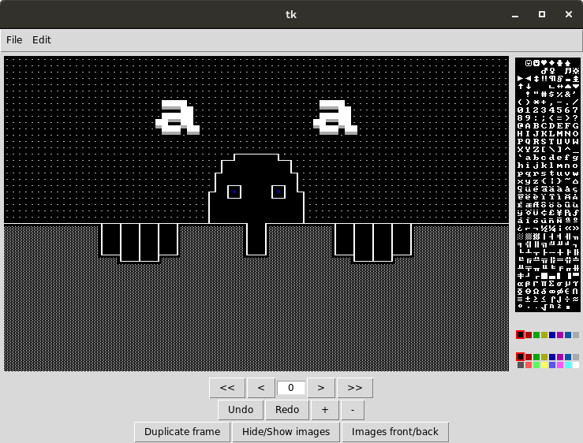

# ANSI animation editor

Version 0.1 or 0.001 or something.
Allows only 80 by 50 character, 640 by 480 pixel frames at the moment. Exports to image sequence.

Important notes:

- undo function doesn't work properly
- only images that are exactly 640 by 480 can be properly imported and used
- the high quality trace is slow but still not particularly visually pleasing
- no documentation
